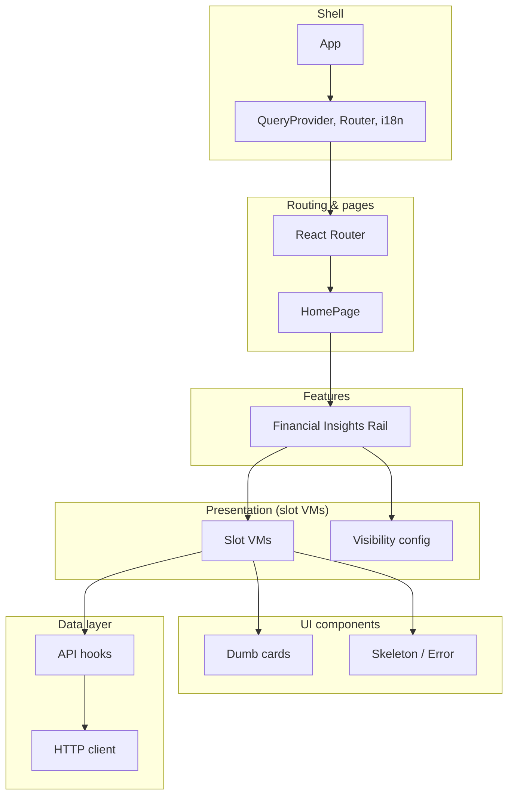

# Financial Insights Widget

Right-rail financial cards (Ratings Summary, Factor Grades, Quant Ranking) with premium gating. React 19, Vite 7, TypeScript, React Query, i18next.

---

## Tech stack

- **React 19** + **TypeScript**
- **Vite 7** (build, dev server)
- **React Router 7** (routing, lazy routes)
- **TanStack Query** (data layer)
- **Tailwind CSS 3** (styling)
- **i18next** (translations; `src/locales/en.json`)
- **Vitest** + **React Testing Library** + **happy-dom** (unit tests)
- **Cypress** (E2E: one critical scenario — premium → slot visibility)
- **ESLint** (type-aware, strict, max-warnings 0)

---

## Prerequisites

- **Node.js** 20+

---

## Setup and run

```bash
# Install dependencies
npm ci

# Development
npm run dev

# Build
npm run build

# Preview production build
npm run preview
```

---

## Scripts

| Script              | Description                     |
|---------------------|---------------------------------|
| `npm run dev`       | Start dev server (Vite)         |
| `npm run build`     | Type-check + production build   |
| `npm run preview`   | Serve `dist` for local preview   |
| `npm run lint`      | ESLint (fails on warnings)      |
| `npm run test`      | Run unit tests (Vitest)         |
| `npm run test:watch`| Run tests in watch mode         |
| `npm run e2e`       | E2E: dev server + Cypress (headless)        |
| `npm run e2e:open`  | Cypress UI (run `npm run dev:e2e` separately) |
| `npm run dev:e2e`   | Dev server on 5174                           |

---

## E2E (Cypress)

One scenario: premium vs non‑premium → which slots are visible. Spec: `cypress/e2e/critical-premium-slots.cy.ts`. First time: `npx cypress install`. Then: `npm run e2e` or `npm run e2e:open` (with `npm run dev:e2e` in another terminal).

---

## Project structure

```
src/
├── App.tsx                    # Root: provider tree (AppMainProvider)
├── main.tsx                   # Imports i18n, renders App
├── appRoutes.config.tsx       # React Router + lazy routes
├── index.css                  # Tailwind + base styles
├── i18n/
│   └── i18n.ts                # i18next + react-i18next, en only
├── locales/
│   └── en.json                # English translations (cards, rail, error)
├── api/                       # Data layer (fetch-based)
│   ├── index.ts               # Re-exports + httpClient singleton
│   ├── config/                # apiConfig (baseUrl)
│   ├── apiUrls/               # Endpoints: user, ratings-summary, factor-grades/*, quant-ranking
│   ├── helpers/               # buildFullUrl.helper
│   ├── httpClient/            # FetchHttpClient, request/response interfaces
│   ├── useUser/               # useUser (premium flag for rail)
│   ├── useRatingsSummary/     # useRatingsSummary
│   ├── useFactorGradesNow/    # useFactorGradesNow
│   ├── useFactorGrades3m/     # useFactorGrades3m
│   ├── useFactorGrades6m/     # useFactorGrades6m
│   └── useQuantRanking/       # useQuantRanking
├── features/
│   └── financialInsightsRail/
│       ├── FinancialInsightsRail.tsx   # Rail: useUser, slot order, SLOT_VM_MAP
│       ├── financialInsightsRail.config.ts  # CARD_SLOT_IDS, isSlotVisible
│       └── vm/
│           ├── QuantRankingCardVM/    # useQuantRanking → skeleton or QuantRankingCard
│           │   └── helpers/            # quantRankingCardVM.helper (mapRankings)
│           ├── RatingsSummaryCardVM/   # useRatingsSummary → skeleton or RatingsSummaryCard
│           │   └── helpers/            # ratingsSummaryCardVM.helper (mapToRows, formatSourceKey)
│           └── FactorGradesCardVM/     # useFactorGradesNow/3m/6m → skeleton or FactorGradesCard
│               └── helpers/            # factorGradesCardVM.helper (sixMToMap, mergeFactorGrades)
├── components/
│   ├── cardSkeleton/          # CardSkeleton (Tailwind pulse)
│   ├── quantRankingCard/      # Dumb: sector, industry, ranks, footer link
│   ├── ratingsSummaryCard/    # Dumb: rows (source, rating, score); source keys dynamic, underscore → space
│   ├── factorGradesCard/      # Dumb: rows (factorKey, now, threeM, sixM); factorKey → t()
│   ├── cardSlotError/         # CardSlotError (isError + retry)
│   ├── errorBoundary/         # ErrorBoundary, ErrorFallback
│   ├── lazyPageBoundary/
│   └── backdropLoading/
├── helpers/                   # buildProvidersTree
├── providers/                 # AppMainProvider, QueryProvider
├── pages/
│   └── homePage/              # HomePage (main + FinancialInsightsRail)
└── test/
    └── setup.ts               # jest-dom, i18n init
```

Path aliases: `@/`, `@api/`, `@api/*`, `@helpers/`, `@providers/`, `@components/`, `@pages/`, `@features/*`, `@locales/*`, `@i18n`.

---

## Architecture


### High-level

Layers from entry down to UI and data; arrows show "uses" / "renders".



| Layer | Role |
|-------|------|
| **Shell** | App root and providers (React Query, React Router, i18n). |
| **Routing & pages** | Lazy routes; pages compose layout and features. |
| **Features** | Rail: decides which slots to show (premium vs non‑premium). |
| **Presentation** | Slot VMs: fetch via hooks, map data, choose Skeleton / Error / Card. |
| **UI components** | Dumb cards and shared states (skeleton, error); props only. |
| **Data layer** | Hooks (useUser, useQuantRanking, …) and shared HTTP client. |

---

## API

Base URL in `api/config/apiConfig.ts` (override via `VITE_API_BASE_URL`). Single `FetchHttpClient`; hooks: `useUser`, `useRatingsSummary`, `useFactorGrades*`, `useQuantRanking`. VM helpers map API keys to display.

---

## Tests

**Unit (Vitest):** 46 tests — Rail, HomePage, dumb cards, CardSlotError, VM helpers, CardSkeleton, ErrorBoundary, providers, API helpers.

**E2E (Cypress):** one scenario (premium → slot visibility), runs in CI.

---

## Build & security

**Chunks:** react-vendor, react-router, react-query, i18n, index, HomePage (lazy). ESM; no `eval`/`dangerouslySetInnerHTML`. API base URL via env; i18n from static `en.json` only.

---

## CI

`.github/workflows/ci.yml`: on push/PR to `main` or `master` — checkout, Node 20, `npm ci`, lint, test, build, `npx cypress install`, `npm run e2e`.
