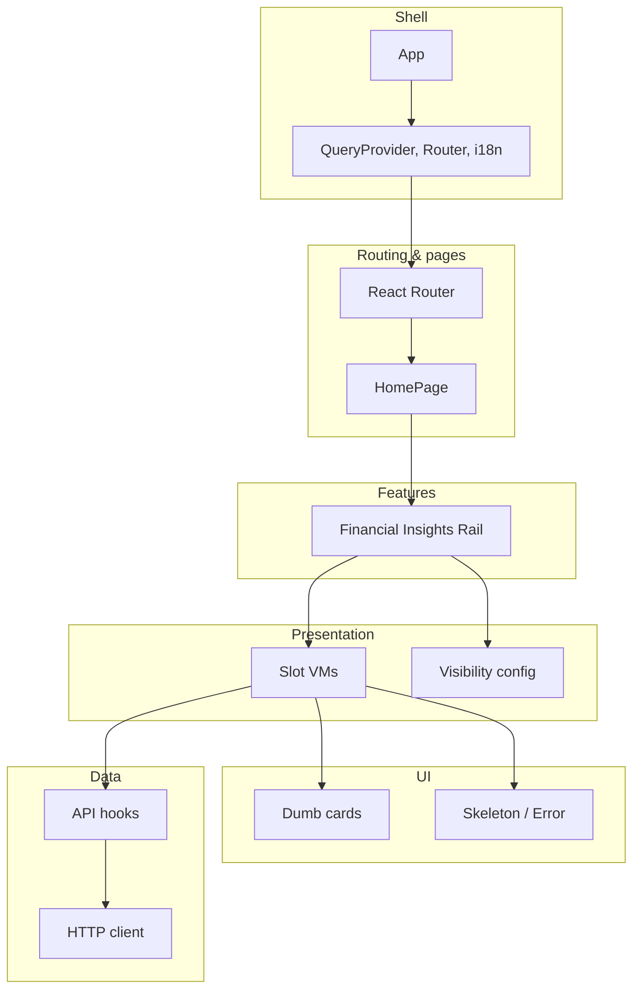

# Financial Insights Widget

Right-rail financial cards (Ratings Summary, Factor Grades, Quant Ranking) with premium gating. React 19, Vite 7, TypeScript, React Query, Tailwind, i18next.

## Prerequisites

Node.js 20+

## Setup

```bash
npm ci
npm run dev
```

Open http://localhost:5173. Build: `npm run build`. Preview: `npm run preview`.

## Scripts

| Command | Description |
|---------|-------------|
| `npm run dev` | Dev server |
| `npm run build` | Type-check + production build |
| `npm run preview` | Serve `dist` |
| `npm run lint` | ESLint (max-warnings 0) |
| `npm run test` | Unit tests (Vitest) |
| `npm run e2e` | E2E: start dev on 5174 + Cypress |
| `npm run e2e:open` | Cypress UI (run `npm run dev:e2e` in another terminal first) |

## Structure

- **`src/pages/homePage`** — Main content + right rail (two-column layout).
- **`src/features/financialInsightsRail`** — Rail: slot order, visibility by premium, slot VMs (skeleton / error / card).
- **`src/components`** — Dumb cards (Quant Ranking, Ratings Summary, Factor Grades), CardSkeleton (variant heights), CardSlotError.
- **`src/api`** — HTTP client, hooks (useUser, useRatingsSummary, useFactorGrades*, useQuantRanking). Base URL in `apiConfig.ts`; override via `VITE_API_BASE_URL`.

Non-premium users see only the Quant Ranking card. Skeleton height matches each card type to avoid layout shift.

## Architecture



## Tests

- **Unit:** 46 tests (Vitest + RTL). Run: `npm run test`.
- **E2E:** One Cypress scenario (premium vs non‑premium → slot visibility). First time: `npx cypress install`. Run: `npm run e2e`.

## CI

`.github/workflows/ci.yml` — on push/PR to `main` or `master`: lint, test, build, Cypress install, e2e.
